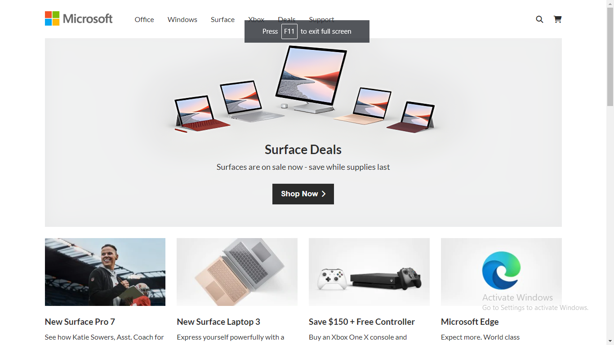

# Microsoft Landing Page

## Description

This project is a landing page for Microsoft website. It is created using HTML and CSS and is responsive for both mobile and tablet screens.

## Components of a landing page

This landing page is divided into following sections :-

- Navbar
- Header / Showcase section
- Product display section
- Xbox section
- Services display section
- Carbon section
- Social links
- Footer

### Preview of the project :-

### [**Live link**](https://microsoft-landing-page-wvty.vercel.app/) of the project.
